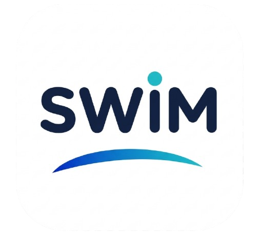

<div align="center">



### SWIM — Speaking & Writing Improvement Mate

**An AI-powered English practice app for evaluating and improving speaking and writing skills.**

**Live Demo:** [swim-ai-english-assistant.streamlit.app](https://swim-ai-english-assistant.streamlit.app)

</div>

---

## Overview

**SWIM (Speaking & Writing Improvement Mate)** is a web-based application built with Streamlit to help users practice and improve their English speaking and writing skills.

The application uses AI to evaluate user responses and provide structured feedback, scores, and suggestions for improvement.

## Features

### Speaking Evaluation

* Record or upload an English speech
* Generate speech transcription
* Evaluate fluency, pronunciation, grammar, and vocabulary
* Get an overall speaking score
* Receive personalized strengths, weaknesses, and improvement suggestions
* View proficiency level based on the overall score

### Writing Evaluation

* Submit English writing directly in the app
* Select CEFR level and writing type
* Evaluate writing quality using AI
* Receive structured feedback and improvement suggestions
* Get an overall writing score

### Evaluation History

* Save previous speaking and writing evaluations
* Review past scores and feedback
* Track learning progress over time

## Tech Stack

* **Python**
* **Streamlit** — Web application framework
* **Google Gemini API** — AI-powered evaluation
* **SQLite** — Evaluation history database
* **Pandas** — Data processing
* **Pillow** — Image handling

## Project Structure

```text
SWIM/
│
├── Home.py
├── pages/
│   ├── Speaking.py
│   ├── Writing.py
│   └── History.py
│
├── modules/
│   └── database.py
│   └── gemini_client.py
│   └── prompts.py
│   └── sidebar.py
│   └── speaking.py
│   └── utils.py
│   └── writing.py
│
├── database/
│   └── history.db
│
├── assets/
│   └── swim.png
│
├── test_gemini.py
│
├── requirements.txt
└── README.md
```

## How It Works

```text
User Input
    │
    ├── Speaking ──► Audio Processing ──► AI Evaluation
    │                                      │
    │                                      ├── Transcript
    │                                      ├── Fluency
    │                                      ├── Pronunciation
    │                                      ├── Grammar
    │                                      └── Vocabulary
    │
    └── Writing ───► Text Processing ────► AI Evaluation
                                           │
                                           ├── Overall Score
                                           ├── Strengths
                                           ├── Weaknesses
                                           └── Suggestions
                                                   │
                                                   ▼
                                             Evaluation History
```

## Installation

Clone the repository:

```bash
git clone https://github.com/yourusername/swim.git
cd swim
```

Install the required dependencies:

```bash
pip install -r requirements.txt
```

Create a `.env` file and add your Gemini API key:

```env
GEMINI_API_KEY=your_api_key
```

Run the application:

```bash
streamlit run app.py
```

## Environment Variables

| Variable         | Description                          |
| ---------------- | ------------------------------------ |
| `GEMINI_API_KEY` | API key used to access Google Gemini |

> Make sure your API key is stored securely and is not committed to GitHub.

## Scoring

|  Score | Proficiency Level  |
| -----: | ------------------ |
| 85–100 | Advanced           |
|  70–84 | Upper-Intermediate |
|  50–69 | Intermediate       |
|   0–49 | Beginner           |

## Purpose

SWIM was developed as a practical AI application that combines:

* Natural Language Processing
* Generative AI
* Speech evaluation
* Writing evaluation
* Database management
* Interactive web application development

The goal is to provide users with an accessible tool for practicing English and receiving immediate, structured feedback.

## Future Improvements

* More detailed pronunciation analysis
* Additional writing assessment criteria
* Progress visualization
* User accounts and personalized learning history
* More speaking practice scenarios
* Support for additional English proficiency levels

## Author

**Hasti Sri Fatmawati**

Built with Python, Streamlit, and Google Gemini.
